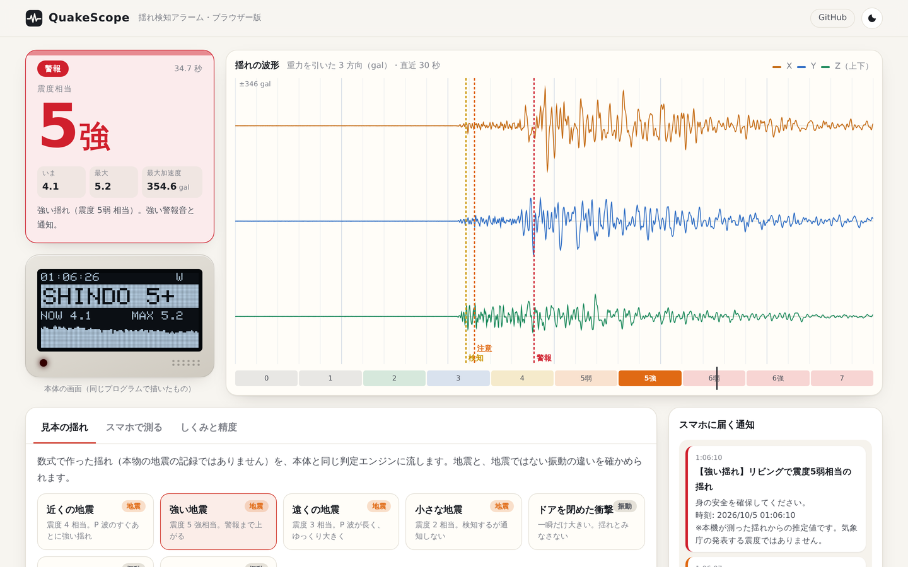
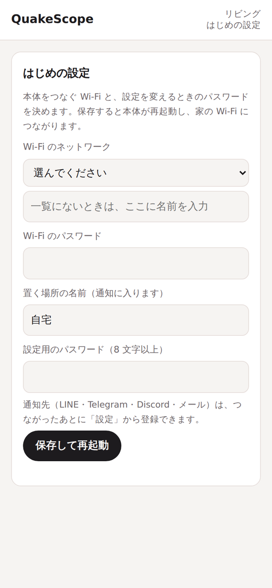
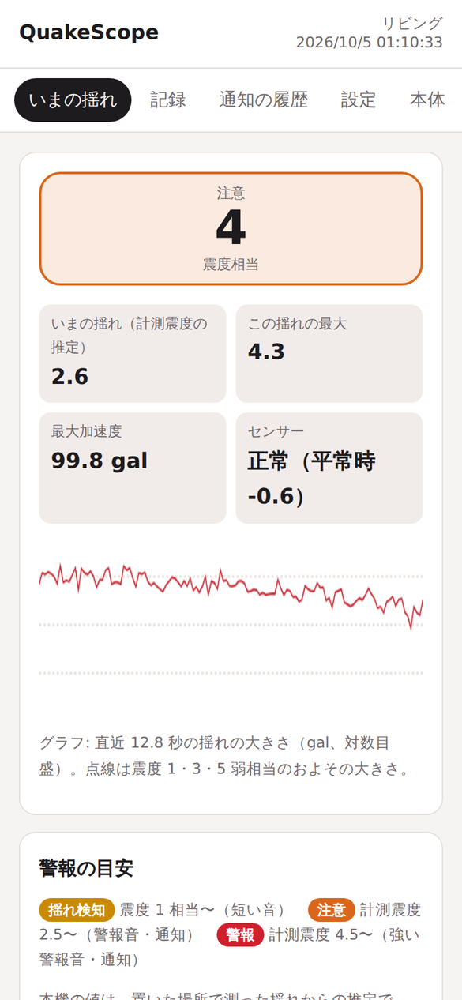
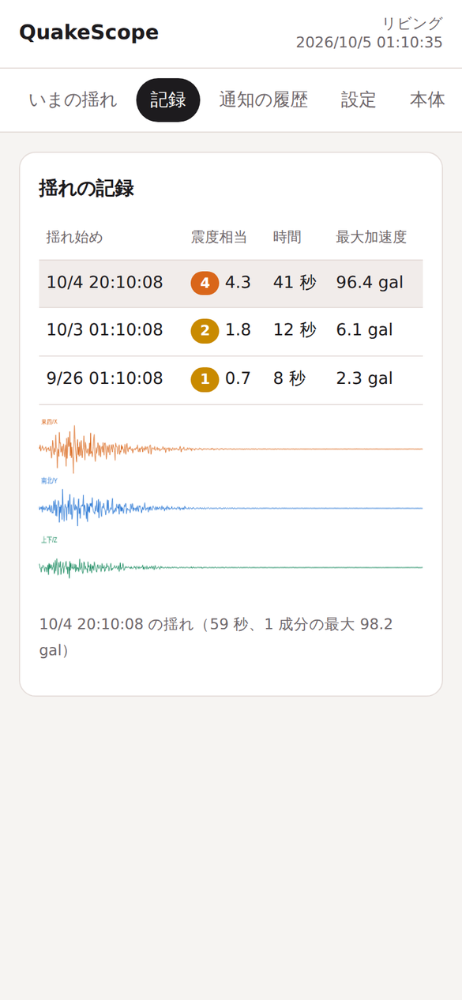
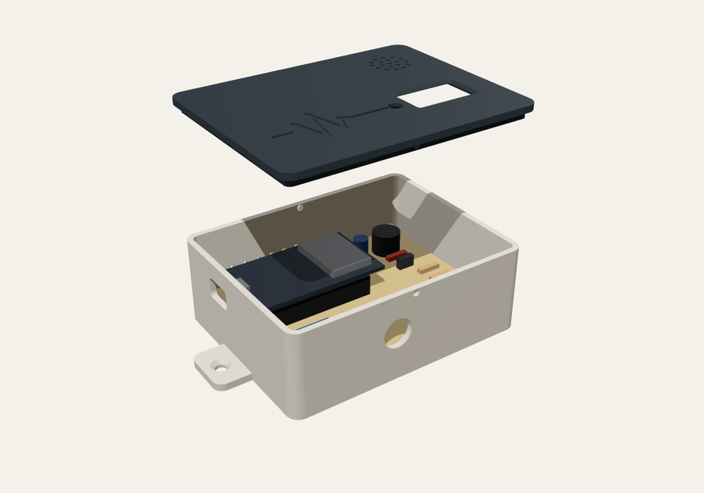

# QuakeScope

**置いた場所の揺れを測り、気象庁の「計測震度」と同じ考え方で震度相当を出す、ESP32 の揺れ検知アラーム。**
強い揺れでは警報音を鳴らし、LINE・Telegram・Discord・メールに知らせます。判定エンジンは C++ で書き、本体とブラウザー（WebAssembly）で同じものを動かしています。

[**ブラウザーで試す**](https://haru-ki417.github.io/QuakeScope/) — 見本の地震や、スマホのセンサーで、本体と同じ判定を確かめられます。



> 本機の値は、置いた場所で測った揺れからの**推定（参考値）**です。気象庁の発表する震度・緊急地震速報ではありません。

## できること

| | |
|---|---|
| **震度相当** | 3 方向の加速度に、気象庁の計測震度と同じ周波数特性のフィルターをかけて計算（100 Hz・0.1 秒ごと）。揺れの最中から表示し、終わったら「この揺れの最大」を残す |
| **揺れ始め** | ふだんとの比（STA/LTA）で P 波をとらえ、短い音で知らせる。ドアや足音のような一瞬の衝撃は揺れとみなさない |
| **3 段階の警報** | 揺れ検知（震度 1 相当〜）・注意（震度 3 相当〜）・警報（震度 5 弱相当〜）。目安は変えられる |
| **通知** | LINE（Messaging API）・Telegram・Discord・メール（SMTP）。1 回の揺れで同じレベルは 1 度だけ、収まったらまとめ |
| **記録** | 揺れの要約 50 件と、揺れ始めの 5 秒前からの波形 8 件を本体に保存。スマホで見られる |
| **初期設定はスマホで** | 本体が自分の Wi-Fi を出し、スマホでつなぐと設定画面が開く。Wi-Fi・通知先・警報の目安を画面で設定 |
| **ケースと基板** | 3D プリントのケース（パラメーターで作り直せる）・回路図・ユニバーサル基板の配置と配線表・部品表 |

<p>



</p>

本体の設定画面（スマホ）。左から、はじめの設定・いまの揺れ・揺れの記録と波形。

## 精度

| 確かめたこと | 結果 |
|---|---|
| 本体の近似（IIR フィルター）と、気象庁の手順どおりの計算（周波数領域）の差 | 見本の地震 96 本で平均 0.024・最大 0.072 |
| 周波数領域の計算と、numpy で別に書いた計算の差 | 10⁻⁶ 以下 |
| 震度 3 以上の近い地震で、強い揺れ（S 波）の前にとらえるか | 5 通りすべて P 波から 1.5 秒以内 |
| ドア・足音・トラックで注意・警報にならないか | すべてならない |
| MPU6050 の雑音（約 3 gal）を入れた見本 | 雑音だけでは鳴らず、震度 3 以上はとらえる |

**限界**: 本体のセンサー（MPU6050）は雑音が大きいため、**震度 2 相当以下の小さな揺れは見逃すことがあります**。また、高い階やたなの上では、建物の揺れが加わって気象庁の震度より大きく出ることがあります。くわしくは[しくみと精度](docs/how-it-works.md)。

## 作る



| | |
|---|---|
| [部品表](hardware/BOM.md) | ESP32-DevKitC-32E・GY-521（MPU6050）・0.96″ OLED・電磁ブザー・フルカラー LED・押しボタンなど。電子部品とケースで 4,500〜6,500 円が目安 |
| [回路図](hardware/schematic.svg) | 部品番号つき |
| [基板の配置と配線表](hardware/wiring.md) | 95×72 mm のユニバーサル基板。穴の番号で部品の位置と 29 本の配線を指定 |
| [ケース](hardware/case/) | `case_base.stl`・`case_lid.stl`。寸法は `case.mjs` の `PARAMS` で変えられる |
| [組み立てと書き込み](docs/assembly.md) | はんだ付けの順番・ファームウェアの書き込み・動作の確認・置き方 |

## 使う

- [使い方](docs/manual.md): はじめの設定・画面と LED の見方・ボタン・警報の目安・記録・更新・困ったとき
- [通知の設定](docs/notifications.md): LINE・Telegram・Discord・Gmail の手順

## 中身

```
core/          判定エンジン（C++17・端末に依存しない）とテスト
  src/         震度の計算・揺れの判定・通知の文面・画面の中身・見本の揺れ
  tests/       26 のテスト（275 項目）
  tools/       見本の揺れの CLI・numpy での確認
firmware/
  QuakeScope/  ESP32 のファームウェア（Arduino）。src/qs は core/src の写し
  web/         本体の設定画面（1 枚の HTML。gzip してファームウェアに入れる）
web/           ブラウザー版（WebAssembly・GitHub Pages）
hardware/      回路図・基板の配置・部品表・ケース
tools/         フィルターの係数を求める・core の写し・設定画面の埋め込み・本体のまね（モック）
docs/          使い方・通知・組み立て・しくみ
legacy/        試作 1 号機（Arduino Uno 版）のスケッチ
```

## 開発

```sh
# エンジンのテスト
cd core/tests && c++ -std=c++17 -O2 -Wall -Wextra -Werror -I../src test_core.cpp ../src/*.cpp -o test_core && ./test_core

# core/src を変えたら、ファームウェアに写す（CI は --check で確かめる）
python3 tools/sync_core.py

# 設定画面（firmware/web/index.html）を変えたら、ファームウェアに埋め込む
python3 tools/embed_web.py

# ブラウザー版の WebAssembly（wasi-sdk が要る）
WASI_SDK=/path/to/wasi-sdk web/build_wasm.sh
python3 -m http.server -d web 8000   # http://localhost:8000/

# 本体なしで設定画面を試す（見本の揺れを流す、本体のまね）
c++ -std=c++17 -O2 -Icore/src core/tools/qs_cli.cpp core/src/*.cpp -o qs_cli
python3 tools/mock_device.py ./qs_cli --port 8080          # 設定済みの本体
python3 tools/mock_device.py ./qs_cli --setup --port 8081  # はじめの設定

# ファームウェア
arduino-cli compile --fqbn esp32:esp32:esp32:PartitionScheme=min_spiffs firmware/QuakeScope

# 回路図・基板の配置・ケース
python3 tools/hw/schematic.py && python3 tools/hw/layout.py
cd hardware/case && npm install && node case.mjs
```

## 安全と法令について

- **気象業務法**: 気象庁以外の者が地震動の**予報**（ほかの場所の揺れや、これから来る揺れの予想）を業務として行うには、気象庁長官の許可が要ります。QuakeScope は、置いた場所で**測った揺れをそのまま表示・通知するだけ**で、予想はしません。通知の文にも、気象庁の震度ではないことを必ず入れています。参考: [気象庁「地震動の予報業務許可」](https://www.jma.go.jp/jma/kishou/minkan/minkan_jishin.html)
- **電波法（技適）**: 日本で使うときは、技適マークのある ESP32 モジュール（ESP32-WROOM-32E など）を使ってください。
- **電源**: PSE マークのある USB AC アダプターを使ってください。停電すると本体もルーターも止まります。[停電と通信](docs/manual.md#停電と通信)を見てください。
- **通知だけに頼らない**: 通信の混雑で、通知は遅れたり届かなかったりします。強い揺れを感じたら、まず身の安全を確保してください。

## 試作 1 号機

QuakeScope は、Arduino Uno で作った「地震即時アラートシステム」を作り直したものです。試作のスケッチと、作り直すときに見つけた問題と対処を [legacy/uno-prototype](legacy/uno-prototype/) に残しています。

## ライセンス

[MIT License](LICENSE)。ほかの人が作ったものは [THIRD_PARTY.md](THIRD_PARTY.md)。
