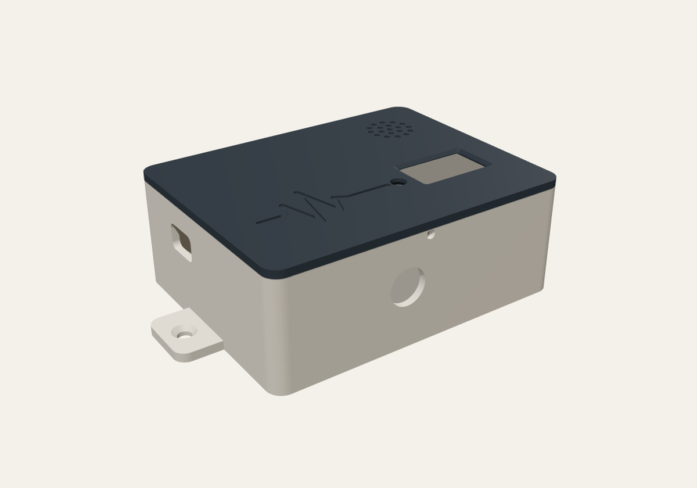
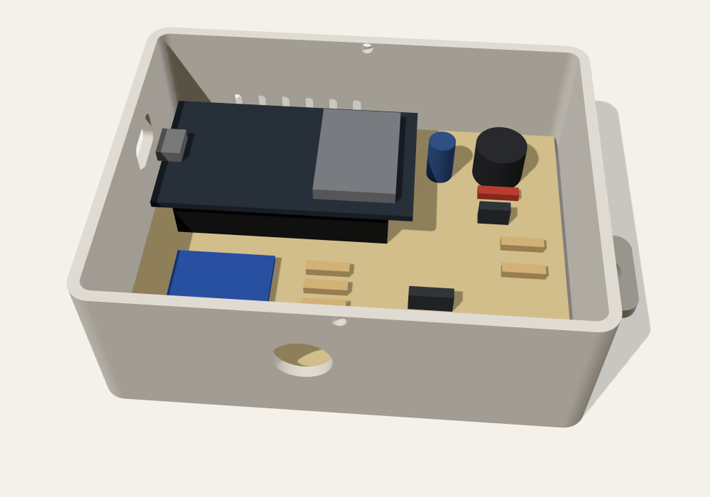
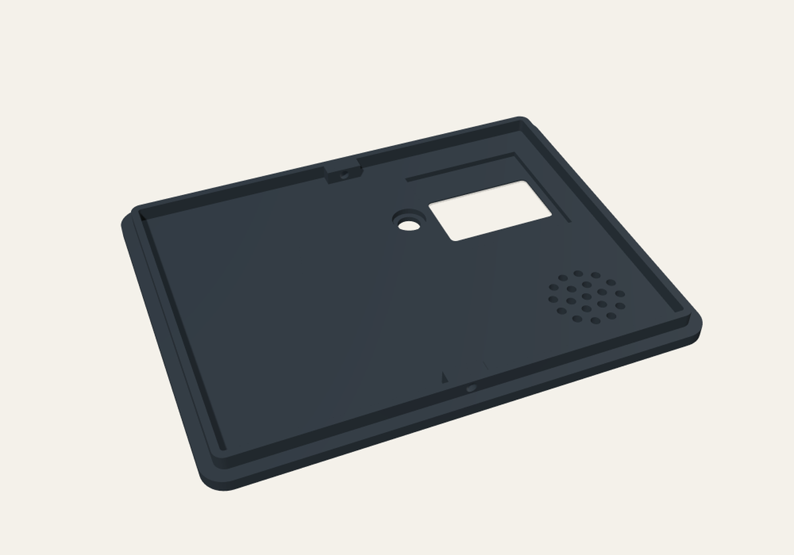

# ケース

| ファイル | 中身 |
|---|---|
| `case_base.stl` | 底（基板を留める柱 4 本・USB の口・前の壁にボタンの穴・後ろの壁に空気の通り道・左右に床へ留める耳） |
| `case_lid.stl` | ふた（OLED の窓・LED の穴・ブザーの音の穴・地震計の波形の模様）。印刷する向き（表を下）で入っている |
| `case.mjs` | 上の 2 つを作るプログラム。寸法は先頭の `PARAMS` で変えられる |

外形は 102.8 × 79.8 × 38.6 mm（耳を除く）。印刷の設定と組み立ては[組み立てと書き込み](../../docs/assembly.md)を見てください。

```sh
npm install     # manifold-3d
node case.mjs   # STL を作り直す（../layout.json の部品の位置に合わせて穴を開ける）
```

| 組み立てた姿 | 中 | ふたの裏 |
|---|---|---|
|  |  |  |
