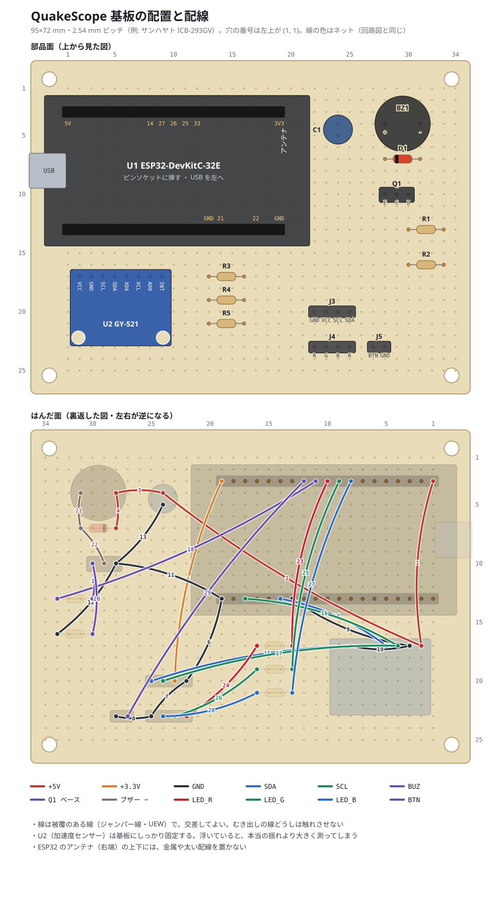

<!-- tools/hw/layout.py が作ったファイルです。手で直さないでください -->
# 基板の配置と配線表

基板: 95×72 mm・2.54 mm ピッチ（例: サンハヤト ICB-293GV）。穴の番号は、部品面を上にして左上の穴が (1, 1)、右へ x、下へ y です。

## 部品の位置

| 部品 | 品名 | 穴（ピン） | メモ |
|---|---|---|---|
| U1 | ESP32-DevKitC-32E | ソケット 2 本: (1〜19, 3) と (1〜19, 13)。(19, 3) が 3V3、(1, 3) が 5V | ピンソケットに挿す（高さ約 8.5 mm） |
| U2 | GY-521（MPU6050） | VCC (2, 17)、GND (3, 17)、SCL (4, 17)、SDA (5, 17)、XDA (6, 17)、XCL (7, 17)、AD0 (8, 17)、INT (9, 17) | ピンヘッダーの黒い台を抜いて低く付け、基板とのすき間に薄い両面テープ（クッションのないもの）を挟んで密着させる |
| BZ1 | 電磁ブザー 12 mm | + (28, 4)、- (31, 4) | 足の間隔 7.6 mm |
| D1 | 1N4148 | K (28, 7)、A (31, 7) | カソード（帯）を左（5V 側） |
| Q1 | 2SC1815 | E (28, 10)、C (29, 10)、B (30, 10) | 平らな面を手前（下）に、左から E C B |
| R1 | 1kΩ | a (30, 13)、b (33, 13) |  |
| R2 | 10kΩ | a (30, 16)、b (33, 16) |  |
| C1 | 100µF 16V | + (24, 4)、- (24, 5) | 足の長い方（+）を上 |
| R3 | 330Ω | a (13, 17)、b (16, 17) |  |
| R4 | 100Ω | a (13, 19)、b (16, 19) |  |
| R5 | 100Ω | a (13, 21)、b (16, 21) |  |
| J3 | OLED へ（L 型ピンヘッダー 1×4） | GND (22, 20)、VCC (23, 20)、SCL (24, 20)、SDA (25, 20) |  |
| J4 | LED へ（L 型ピンヘッダー 1×4） | R (22, 23)、G (23, 23)、B (24, 23)、K (25, 23) |  |
| J5 | ボタンへ（L 型ピンヘッダー 1×2） | BTN (27, 23)、GND (28, 23) |  |

## 配線表

上から順につなぐと、抜けがありません。1 本つないだら、テスターの導通チェックで確かめてください。

| # | ネット | から | へ | から（穴） | へ（穴） |
|---|---|---|---|---|---|
| 1 | +5V | U1 5V | U2 VCC | (1, 3) | (2, 17) |
| 2 | +5V | U2 VCC | C1 + | (2, 17) | (24, 4) |
| 3 | +5V | C1 + | BZ1 + | (24, 4) | (28, 4) |
| 4 | +5V | BZ1 + | D1 K | (28, 4) | (28, 7) |
| 5 | +3.3V | U1 3V3 | J3 VCC | (19, 3) | (23, 20) |
| 6 | GND | U1 GND | J3 GND | (19, 13) | (22, 20) |
| 7 | GND | J3 GND | J4 K | (22, 20) | (25, 23) |
| 8 | GND | J4 K | J5 GND | (25, 23) | (28, 23) |
| 9 | GND | U1 GND | U2 GND | (13, 13) | (3, 17) |
| 10 | GND | U2 GND | U2 AD0 | (3, 17) | (8, 17) |
| 11 | GND | U1 GND | Q1 E | (19, 13) | (28, 10) |
| 12 | GND | Q1 E | R2 | (28, 10) | (33, 16) |
| 13 | GND | Q1 E | C1 - | (28, 10) | (24, 5) |
| 14 | SDA | U1 IO21 | U2 SDA | (14, 13) | (5, 17) |
| 15 | SDA | U2 SDA | J3 SDA | (5, 17) | (25, 20) |
| 16 | SCL | U1 IO22 | U2 SCL | (17, 13) | (4, 17) |
| 17 | SCL | U2 SCL | J3 SCL | (4, 17) | (24, 20) |
| 18 | BUZ | U1 IO25 | R1 | (11, 3) | (33, 13) |
| 19 | Q1 ベース | R1 | Q1 B | (30, 13) | (30, 10) |
| 20 | Q1 ベース | Q1 B | R2 | (30, 10) | (30, 16) |
| 21 | ブザー − | BZ1 - | D1 A | (31, 4) | (31, 7) |
| 22 | ブザー − | D1 A | Q1 C | (31, 7) | (29, 10) |
| 23 | LED_R | U1 IO26 | R3 | (10, 3) | (13, 17) |
| 24 | LED_R | R3 | J4 R | (16, 17) | (22, 23) |
| 25 | LED_G | U1 IO27 | R4 | (9, 3) | (13, 19) |
| 26 | LED_G | R4 | J4 G | (16, 19) | (23, 23) |
| 27 | LED_B | U1 IO14 | R5 | (8, 3) | (13, 21) |
| 28 | LED_B | R5 | J4 B | (16, 21) | (24, 23) |
| 29 | BTN | U1 IO33 | J5 BTN | (12, 3) | (27, 23) |
